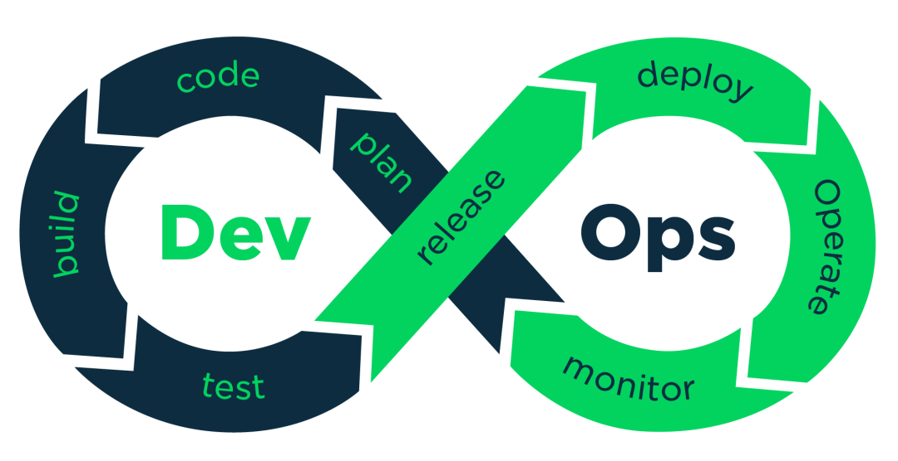
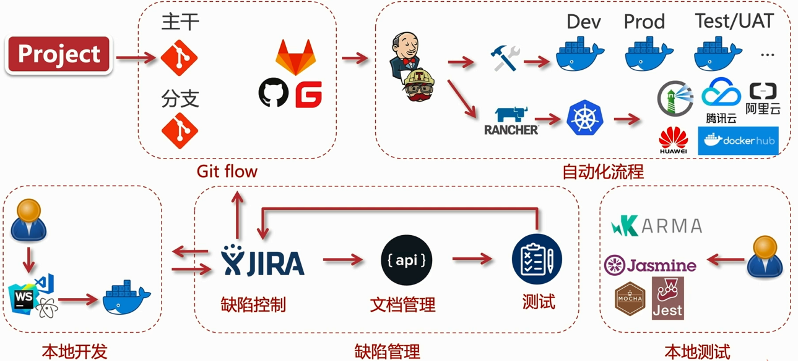

## 大前端

### 项目流程

#### 敏捷开发(agile development)

##### 迭代开发

**敏捷开发的核心是迭代开发（iterative development）。敏捷一定是采用迭代开发的方式。**

迭代的英文是 iterative，直译为"重复"，迭代开发其实就是"重复开发"。

对于大型软件项目，传统的开发方式是采用一个大周期进行开发；迭代开发的方式则不一样，它将开发过程拆分成多个小周期，即一次"大开发"变成多次"小开发"，每次小开发都是同样的流程，所以看上去就好像重复在做同样的步骤。

**迭代开发将一个大任务，分解成多次连续的开发，本质就是逐步改进。**开发者先快速发布一个有效但不完美的最简版本，然后不断迭代。每一次迭代都包含规划、设计、编码、测试、评估五个步骤，不断改进产品，添加新功能。通过频繁的发布，以及跟踪对前一次迭代的反馈，最终接近较完善的产品形态。

##### 增量开发

怎么划分迭代，哪个任务在这个迭代，哪个任务在下个迭代？这时，一般采用"增量开发"（incremental development）划分迭代。

**所谓"增量开发"，指的是软件的每个版本，都会新增一个用户可以感知的完整功能。也就是说，按照新增功能来划分迭代。**

**增量开发加上迭代开发，才算真正的敏捷开发。**

##### 敏捷开发的好处

- 早期交付

**敏捷开发的第一个好处，就是早期交付，从而大大降低成本。**

- 降低风险

**敏捷开发的第二个好处是，及时了解市场需求，降低产品不适用的风险。**

由于敏捷开发可以不断试错，找出对业务最重要的功能，然后通过迭代，调整软件方向。相比传统方式，大大增加了产品成功的可能性。如果市场需求不确定，或者你对该领域不熟悉，那么敏捷开发几乎是唯一可行的应对方式。

##### 如何进行每一次迭代

虽然敏捷开发将软件开发分成多个迭代，但是也要求，**每次迭代都是一个完整的软件开发周期，必须按照软件工程的方法论，进行正规的流程管理。**

具体来说，每次迭代都必须依次完成以下五个步骤。

> 1. 需求分析（requirements analysis）
> 2. 设计（design）
> 3. 编码（coding）
> 4. 测试（testing）
> 5. 部署和评估（deployment / evaluation）

每个迭代大约持续2~6周。

##### 敏捷开发的价值观

《敏捷软件开发宣言》里面提到四个价值观。

> - 程序员的主观能动性，以及程序员之间的互动，优于既定流程和工具。
> - 软件能够运行，优于详尽的文档。
> - 跟客户的密切协作，优于合同和谈判。
> - 能够响应变化，优于遵循计划。

##### 十二条原则

该宣言还提出十二条敏捷开发的原则。

1. 通过早期和持续交付有价值的软件，实现客户满意度。
2. 欢迎不断变化的需求，即使是在项目开发的后期。要善于利用需求变更，帮助客户获得竞争优势。
3. 不断交付可用的软件，周期通常是几周，越短越好。
4. 项目过程中，业务人员与开发人员必须在一起工作。
5. 项目必须围绕那些有内在动力的个人而建立，他们应该受到信任。
6. 面对面交谈是最好的沟通方式。
7. 可用性是衡量进度的主要指标。
8. 提倡可持续的开发，保持稳定的进展速度。
9. 不断关注技术是否优秀，设计是否良好。
10. 简单性至关重要，尽最大可能减少不必要的工作。
11. 最好的架构、要求和设计，来自团队内部自发的认识。
12. 团队要定期反思如何更有效，并相应地进行调整。

#### DevOps流程

计划---编码---打包---发布测试---发布正式版本---运维---监控



详细流程



#### 需求分析

全局思维，重难点分析，工具使用，制作需求文档原型图流程图等

**分类**

业务需求：业务痛点挖掘，用户业务建模，明确业务流程，输出分析结论

用户需求：理论（马斯洛需求理论）方法（场景分析，用户分析，行为分析）

系统需求：规范，性能，硬件环境（升级，平台），非功能性，异常处理

**工作流**

定义（idea）---捕获（沟通了解用户需求）---分析/建模（流程图，原型图，表格，说明文档等）---验证（用户确认，技术评审，项目评审：包括时间，质量，资源投入等）---跟踪（反馈，变更）---形成文档

##### 前期考虑

- **业务类型**

业务型（无纸化带来的效率提升），痛点型（市场决定的风口）功能性（企业&客户需求，解决流量入口）

- **需求分析痛点**

不想就做，照单全收，未沟通确认，放羊管理（项目经理确认跟踪沟通）

- **需求分析难点**

同时考虑功能，时间和成本

形成需求文档，用户回馈确认

引导用户需求，创造用户需求---往熟悉或发展的地方靠

- **需求分析的组成部分**

以本项目为例

项目需求：全栈，前端痛点，对接企业，全周期，跨端，多场景

业务需求：社区应用，登陆鉴权，用户体系，积分系统，发帖收藏，点赞回复，内容管理

用户需求：交互简单，界面美观，运行流畅，功能实用，定制需求，其他需求

具体产出：需求文档，项目选型，技术栈选型，开发周期预估，项目进度预估，分项原型图，分项流程图

##### 需求变更

经过和用户的沟通和确认之后用户提出来的需求

1. 变更是否合理---工期，费用，技术
2. 是否项目范围内变更，对主体业务是否有影响
3. 明确需求变更流程，确定需求变更

对于产品经理的变更

沟通---提出要求---引导需求---自我挑战

##### 核心业务需求分析

前端：页面/交互---组件化，代码复用---工程化，接口定义---标准化

后台：接口开发---自动化，管理后台---模块化，缺陷管理---流程化

业务：登陆鉴权---前后分离，内容展示---多场景，个人中心---用户体系

功能：筛选---搜索，统计---积分系统，评论---消息

整体需求分析：

前后端分离---接口鉴权---数据通用性---数据库设计

内容管理---搜索---筛选---积分管理体系

社区业务---权限---积分---用户体系

##### 原型设计

用线条图形描绘产品框架，也叫线框图

**目标**

- 展示布局逻辑结构
- 表明状态关系和跳转关系（部分使用流程图）
- 低成本快速修改

##### 需求分析

**PC需求分析**

> 遇到不确定的需求问题：借鉴（设计网站花瓣，站酷，蓝色理想或类似的产品），专业人士（同事）沟通，客户沟通

内容展示：列表，交互

回复点赞

用户体系与用户体系

> Axure原型图：
>
> 版本说明---更新日志（包含时间和更新内容，A新增C样式变更D准备移除R移除M逻辑变更）
>
> 业务模块。。。

文档产出：重要页面原型图，主体页面流程图，说明文档.md

**服务端需求分析**

用户/权限管理，内容管理，首页管理，其他功能（日志，多语言等）

**webapp和小程序原型**

- 主体功能

- 技术实现/交互体验

- 用户数据和流量入口（是否有必要开发webapp或小程序）

文档产出：重要页面原型图，主体页面流程图，说明文档.md

##### 工具

原型类：Axure，Ps，墨刀（在线，模版丰富，更加高保真），蓝湖，MockPlus

功能类：脑图（Xmind，MindNode（Mac），MindManager）

流程图：Visio（Win）/OmniGraffle（Mac）/processOn（在线）

**Axure**

设置默认保存时间，生成html文件，默认组件，流程图，预览，浏览器插件，模块化设计，锁定模块，组件对齐方式，交互

**墨刀（在线，模版丰富，更加高保真）**

free.modao.cc

**Process**

processon.com

##### 技术栈

团队技术实力和业务需求结合

能复用不造轮，需造轮不牵强

怎么简单怎么来，考虑时间进度成本质量因素

前端：

响应式，LayUI，Vuejs，Vuex，Vue-router

WebApp，Mint，Sass/Scss，iScroll

小程序，MINA，mpvue

Web服务：Nginx+HTTPS/Caddy，RESTful API，WebSocket（消息）

业务层服务层CI/CD流程：koa，iVew-admin，日志服务，文档管理，版本控制，接口测试，持续集成等

存储层：MongoDB，Redis

运行环境：Docker/自定义Dockerfile/私有仓库Harbor

## 环境搭建

### 开发环境搭建

**准备三个环境**

本地环境：nodejs，IDE，vue-cli

测试环境：Linux环境（三选一：虚拟机，云服务1c+2G，安装Docker）

数据库服务：Mongodb

#### 简版

##### 本地环境

**Nodejs12.16.3（npm6.14.4/yarn1.22.10）+nvm0.37.2**

yarn：安装参考官方仓库

nvm：mac使用nvm，win使用nvm-windows，安装参考官方仓库`curl -o- https://raw.githubusercontent.com/nvm-sh/nvm/v0.37.2/install.sh | bash`

> 安装报错：Failed to connect to raw.githubusercontent.com port 443: Connection refused
>
> 解决：点击如下网址`https://www.ipaddress.com/`来查询raw.githubusercontent.com的真实ip，然后在用sudo vim /etc/hosts修改hosts`199.232.28.133 raw.githubusercontent.com`不成功的话试试151.101.76.133
>
> 再次安装后报：
>
> Resolving deltas: 100% (38/38), done.
>
> => Compressing and cleaning up git repository
>
> 
>
> => Profile not found. Tried ~/.bashrc, ~/.bash_profile, ~/.zshrc, and ~/.profile.
>
> => Create one of them and run this script again
>
>   OR
>
> => Append the following lines to the correct file yourself:
>
> 
>
> export NVM_DIR="$HOME/.nvm"
>
> [ -s "$NVM_DIR/nvm.sh" ] && \. "$NVM_DIR/nvm.sh" # This loads nvm
>
> 
>
> npm ERR! peer dep missing: vue@3.0.5, required by @vue/compiler-sfc@3.0.5
>
> => You currently have modules installed globally with `npm`. These will no
>
> => longer be linked to the active version of Node when you install a new node
>
> => with `nvm`; and they may (depending on how you construct your `$PATH`)
>
> => override the binaries of modules installed with `nvm`:
>
> 
>
> /usr/local/lib
>
> ├── @vue/cli@4.5.11
>
> ├── create-react-app@3.4.1
>
> ├── typescript@4.1.3
>
> └── yarn@1.22.10
>
> => If you wish to uninstall them at a later point (or re-install them under your
>
> => `nvm` Nodes), you can remove them from the system Node as follows:
>
> 
>
>    $ nvm use system
>
>    $ npm uninstall -g a_module
>
> 
>
> => Close and reopen your terminal to start using nvm or run the following to use it now:
>
> 
>
> export NVM_DIR="$HOME/.nvm"
>
> [ -s "$NVM_DIR/nvm.sh" ] && \. "$NVM_DIR/nvm.sh" # This loads nvm
>
> 解决：
>
> 1、cd ~ ( 进入当前用户的home目录)
>
> 2、open .bash_profile (打开.bash_profile文件，如果文件不存在就 创建文件：touch .bash_profile 编辑文件：open -e .bash_profile)
>
> 3、直接更改弹出的.bash_profile文件内容,把以下内容粘贴进去（添加环境变量）：
>
> ```
> export NVM_DIR="$HOME/.nvm"
> [ -s "$NVM_DIR/nvm.sh" ] && \. "$NVM_DIR/nvm.sh"  # This loads nvm
> ```
>
> 4、command + s 保存文件，然后关闭 。
>
> 5、在terminal(终端)中输入 source .bash_profile (使用刚才更新之后的内容)。
>
> 6、nvm --version
>
> 7、0.37.2～成功～

```cmd
nvm list
nvm use xxx
```

**IDE（vscode，webstorm，atom）**

**Vue-Cli**

安装：npm i -g @vue/cli

快速原型开发：npm i -g @vue/cli-service-global（未安装，需要时再安装，比如vue serve不能运行vue文件）

##### 测试环境及mongo数据库环境

三种方式：

- 虚拟机自建环境（Parallels/Vmware/Hyperv）

- 云服务（一核2G以上）

- 安装Docker（轻量容器服务）

  在Linux安装参考docker-install仓库

  From `https://get.docker.com`:

```
curl -fsSL https://get.docker.com -o get-docker.sh
sh get-docker.sh
```
```
其他环境参考官网
- docker集合命令工具：docker compose，安装参考docker官网（安装，权限）
```
    # 安装
    sudo curl -L "https://github.com/docker/compose/releases/download/1.28.2/docker-compose-$(uname -s)-$(uname -m)" -o /usr/local/bin/docker-compose
    # 上面安装后执行docker-compose -v出错，可能是网络原因没有装完整，换一种安装方式
    wget https://github.com/docker/compose/releases/download/1.25.0/docker-compose-$(uname -s)-$(uname -m) -O /usr/local/bin/docker-compose
    # 权限
    sudo chmod +x /usr/local/bin/docker-compose
    # 查看版本
    docker-compose -v

  - docker中安装mongodb服务
  
    dockerhub中找到mondodb，查找到latest最新版本，安装指定版本`docker pull mongo:4`
  
    下载慢可配置中国源（参考[docker doc](https://docs.docker.com/registry/recipes/mirror/)），这里用到vi
> Either pass the `--registry-mirror` option when starting `dockerd` manually, or edit [`/etc/docker/daemon.json`](https://docs.docker.com/engine/reference/commandline/dockerd/#daemon-configuration-file) and add the `registry-mirrors` key and value, to make the change persistent.
>
> ```
> {
> "registry-mirrors": ["https://registry.docker-cn.com"]
> }
> ```

修改完之后重启docker`service docker restart`重新下载

> 报错：Error response from daemon: Get https://registry-1.docker.io/v2/: net/http: request canceled while waiting for connection (Client.Timeout exceeded while awaiting headers)
>
> 方法一：增加国内镜源（不起作用）
>
> 方法二：（可行）
>
> 第一步：通过`dig @114.114.114.114 registry-1.docker.io`找到可用IP地址
>
> 第二步：修改`/etc/hosts`强制docker.io相关的域名解析到其它可用IP
>
> 第三步：保存配置文件后进行多次重试可以成功下载镜像

启动服务（docker run -d --name some-mongo -p 10050:27017 mongo:4）

在测试之前，在宿主机防火墙放行10050端口（映射的容器中的27017端口）两种方式（1关闭防火情Ubuntu：service ufw stop CentOS：service firewalld stop，2将10050添加到放行规则Ubuntu：ufw allow Port10050 CentOS：firewall -cmd --zoom=public --add-port=10050/tcp --permanent 回车成功后 firewall-cmd reload 不成功时查看状态 firewall -cmd --state）

> 推荐远程mongo服务的工具：robo 3t，图形化界面

#### 开发系统环境

##### 虚拟机

- **windows：vmware，Hyper-V**

win10以上以及windows server都是有默认的hyper-v组件

- **mac：Parrallels Desktop**

安装centos7镜像7.6 1810 DVD版，ctrl+option释放光标：选择时区，选择语言，INSTALLATION（done），SOFTWARE（Virtualization Host全选），NETWORK（ON，Config配置网络默认），BEGIN INSTALL，设置密码，Rebot

注意：最开始要选择英文

> 安装7.9 2009DVD版：

- **Linux：Hypervisor**

##### Linux

Linux是一种开源电脑操作系统内核，c语言编写，符合POSIX标准的类Unix操作系统

- **版本**

linux发行版：简单来说就是linux内核和应用软件的打包，常用linux发行版：CentOS，Ubuntu，redhat，Debain，Fedora等

CentOS：镜像下载推荐DVD，https://wiki.centos.org/zh/Download，选择镜站进行下载

Debain：系统资源占用少，社区维护，更新快

Ubuntu：基于Debain，桌面版新手友好

> Ubuntu:  <http://mirrors.aliyun.com/ubuntu-releases/>
>
> Centos: <https://mirrors.aliyun.com/centos/>
>
> 阿里云镜像：<https://opsx.alibaba.com/mirror>
>
> 清华镜像：<https://mirrors.tuna.tsinghua.edu.cn/>

- **目录结构**

- **文件权限**

- **硬件/性能**

ssh链接远程系统

查看版本

查看硬件资源

测试硬件性能

```
ssh -p 27822 name@xxx.xxx.cn
lsb_release -a # 查看版本，未找到lsb_release时，安装lsb：yum install redhat-lsb -y，切换root：su
uname -a # 查看内核版本

df # 查看磁盘空间
df -Th # 以G为单位查看磁盘空间

cd /
ls -la # 查看文件目录及权限
```

目录结构

```
...
home # 个人目录
etc # 软件的配置文件
sys # 系统目录
usr # 系统可执行文件
	sbin # 超级管理员可执行文件
	local # 本地可执行文件
	...
var # 日志文件
	www # 网站目录
```

cpu/内存/进程

```
top # 查看在运行的进程/cpu/内存使用情况 m # 查看内存使用情况 ctrl+c # 退出top命令
```

> mount，df，Top，性能测试方法（）好像有的没讲到。。。

#### Linux常见指令

文档型：文件相关命令（touch，cat，echo，rm，vi，cd）

硬件型：磁盘/进程/服务/网络

功能型：压缩/解压，下载，远程

##### 文件

增删改查，权限控制，路径

```
ls # 查看目录
mkdir # 新建目录
touch xxx # 新建xxx文件
vi xxx # 进入vim编辑器
i # insert状态
esc:wq # 保存退出
esc:q! # 不保存退出
cat xxx # 查看xxx文件内容
echo 'content' >> xxx # 在文件后面增加content内容
echo 'content' > xxx # 覆盖在文件内容
rm xxx # 删除文件
rm -r xxx # 删除目录
rm -rf xxx # 强制删除
```

##### 磁盘

```
pwd # 查看当前完整路径
```

##### 用户及组

##### 下载/压缩/解压

```
wget url # 下载
tar zxvf xxx # 解压 z 代表gz结尾，x解压缩 v显示解压过程 f使用归档的名字
tar zcvf 压缩后文件名 要压缩的目录 # 压缩
```

##### 进程/服务

```
ps -ef ｜ grep docker # 查看进程 grep 搜索进程
kill -9 进程id # 9 强制终止
service 服务名称（sshd） status # 查看系统服务状态
service 服务名称 stop # 关闭服务
service 服务名称 restart # 重启服务
systemctl status 服务名称（firewalld.service）
```

##### 网络

防火墙，IP DNS设置，下载，SSH远程

ssh远程连接Linux

ssh（Secure Shell安全外壳协议）加密，安全，默认22端口，容易受到攻击需要改默认端口

```
ssh -p 22 root（用户名）@（ip地址）
输入密码
cat /etc/hostname # 查看主机名

# 修改 ssh 默认端口
service sshd status # Ubuntu系统是 ssh 不是sshd
netstat -anlp ｜ grep sshd # 查看默认端口
vi /etc/ssh/sshd_config # vim打开配置文件
Port 10022 # 修改 Port
semanage port -a -t ssh_port_t -p tcp #PORTNUMBER # 通知 SELinux 端口已经改变，Ubuntu 不需要这一步
yum whatprovides semanage # 提示 semanage 不存在时，反查哪个包提供这个命令
yum insatll -y policycoreutils-pthon # 安装这个包，重复上面命令
semanage port -l ｜ grep ssh # 查看默认端口
semanage port -d  -t ssh_port_t -p tcp xxxxx # 删除多余端口号
service sshd restart # 重启 ssh

PasswordAuthentication no # 修改配置文件最后一句，使用 root 用户登录时不再验证密码

# ssh密钥登录，免密码登录
# 在本地
cd ~/.ssh
ls
ssh-keygen # 在本地生成ssh key，在id_rsa.pub文件中
vi config # 修改配置
Host naixes 
	Port 10022 
	HostName xx.xxx.xxx.xxx
	User root
	IdentityFile ~/.ssh/id_rsa
	IdentitiesOnly yes # 添加
# 在服务器
cd ~/.ssh
ls
mkdir -p ~/.ssh # 没有文件时新建
vi authorized_keys
# 添加一行，公钥的内容，即id_rsa.pub里面的内容，保存

ssh naixes # 登录服务器
```

#### Docker初识

##### 定义

为了解决环境配置问题，容器化应用

**Docker 属于 Linux 容器的一种封装，提供简单易用的容器使用接口。**它是目前最流行的 Linux 容器解决方案。

Docker 将应用程序与该程序的依赖，打包在一个文件里面。运行这个文件，就会生成一个虚拟容器。程序在这个虚拟容器里运行，就好像在真实的物理机上运行一样。有了 Docker，就不用担心环境问题。

总体来说，Docker 的接口相当简单，用户可以方便地创建和使用容器，把自己的应用放入容器。容器还可以进行版本管理、复制、分享、修改，就像管理普通的代码一样。

**vs虚拟机**

> docker：app1 app2 --- Docker --- 操作系统 --- 基础设施（共用操作系统和基础设施，由docker进程管理应用，比虚拟机快得多）
>
> 虚拟机：虚拟机1 --- 操作系统1 --- 虚拟化平台 --- 基础设施（占用系统资源多）

###### 虚拟机（virtual machine）

就是带环境安装的一种解决方案。它可以在一种操作系统里面运行另一种操作系统，比如在 Windows 系统里面运行 Linux 系统。应用程序对此毫无感知，因为虚拟机看上去跟真实系统一模一样，而对于底层系统来说，虚拟机就是一个普通文件，不需要了就删掉，对其他部分毫无影响。

虽然用户可以通过虚拟机还原软件的原始环境。但是，这个方案有几个缺点。

**（1）资源占用多**

虚拟机会独占一部分内存和硬盘空间。它运行的时候，其他程序就不能使用这些资源了。哪怕虚拟机里面的应用程序，真正使用的内存只有 1MB，虚拟机依然需要几百 MB 的内存才能运行。

**（2）冗余步骤多**

虚拟机是完整的操作系统，一些系统级别的操作步骤，往往无法跳过，比如用户登录。

**（3）启动慢**

启动操作系统需要多久，启动虚拟机就需要多久。可能要等几分钟，应用程序才能真正运行。

###### Linux 容器

由于虚拟机存在这些缺点，Linux 发展出了另一种虚拟化技术：**Linux 容器（Linux Containers，缩写为 LXC）**。

**Linux 容器不是模拟一个完整的操作系统，而是对进程进行隔离。**或者说，在正常进程的外面套了一个[保护层](https://opensource.com/article/18/1/history-low-level-container-runtimes)。对于容器里面的进程来说，它接触到的各种资源都是虚拟的，从而实现与底层系统的隔离。

由于容器是**进程级别的**，相比虚拟机有很多优势。

**（1）启动快**

容器里面的应用，直接就是底层系统的一个进程，而不是虚拟机内部的进程。所以，启动容器相当于启动本机的一个进程，而不是启动一个操作系统，速度就快很多。

**（2）资源占用少**

容器只占用需要的资源，不占用那些没有用到的资源；虚拟机由于是完整的操作系统，不可避免要占用所有资源。另外，多个容器可以共享资源，虚拟机都是独享资源。

**（3）体积小**

容器只要包含用到的组件即可，而虚拟机是整个操作系统的打包，所以容器文件比虚拟机文件要小很多。

总之，容器有点像轻量级的虚拟机，能够提供虚拟化的环境，但是成本开销小得多。

**特性**

文件，资源，网络隔离

变更管理：commit pull push等命令，日志记录

写时复制：用写时复制的方式创建根文件系统，而虚拟机要划分一部分系统资源

##### 安装

Docker 分为 CE 和 EE 两大版本。CE 即社区版（免费），EE 即企业版，强调安全，付费使用。Docker支持在主流的操作系统平台上使用，包括Ubuntu、Centos、Windows、MacOS系统等。
Docker CE 分为 stable, test, 和 nightly 三个更新频道。每六个月发布一个 stable 版本 (18.09, 19.03, 19.09...)。

Mac：安装docker.dmg，使用docker version 查看版本，自带docker compose集合命令工具

Linux：测试环境中的的方法是使用了官方提供的一套便捷的安装脚本

官方文档：https://docs.docker.com/engine/install/centos/

- 卸载之前安装的docker

```cmd
$ sudo yum remove docker \
docker-client \
docker-client-latest \
docker-common \
docker-latest \
docker-latest-logrotate \
docker-logrotate \
docker-selinux \
docker-engine-selinux \
docker-engine
# 报错 Error: Trying to remove "yum", which is protected
# 解决：忽略依赖只移除自己
rpm -e --nodeps docker \
docker-client \
docker-client-latest \
docker-common \
docker-latest \
docker-latest-logrotate \
docker-logrotate \
docker-selinux \
docker-engine-selinux \
docker-engine
```

- 安装依赖

```cmd
$ sudo yum install -y yum-utils \
device-mapper-persistent-data \
lvm2
```

添加stable的Docker-ce源

```cmd
$ sudo yum-config-manager \
--add-repo \
https://mirrors.ustc.edu.cn/docker-ce/linux/centos/docker-ce.repo
# 阿里源
sudo yum-config-manager --add-repo http://mirrors.aliyun.com/docker-ce/linux/centos/docker-ce.repo
# 官方源
$ sudo yum-config-manager \
--add-repo \
https://download.docker.com/linux/centos/docker-ce.repo
```

> 如果需要测试版本的 Docker CE 请使用以下命令：
>
> 1. `$ sudo yum-config-manager --enable docker-ce-test`
>
> 如果需要每日构建版本的 Docker CE 请使用以下命令：
>
> 1. `$ sudo yum-config-manager --enable docker-ce-nightly`
>
> 更新 yum 软件缓存：
>
> ```cmd
> sudo yum makecache fast
> ```

- 安装 Docker-ce：

```
sudo yum install docker-ce docker-ce-cli containerd.io
```

启动 Docker 后台服务

```
systemctl start docker
# 查看状态
systemctl status docker
# 启动hello-word
sudo docker run hello-world
# 报错：Unable to find image 'helle-word:latest' locally，提示本地没找到，然后开始从远程拉取
```

在`/etc/docker/daemon.json`中配置中国源

```cmd
# 配置完成后重启
systemctl daemon-reload
systemctl restsrt docker
```

##### 命令

```cmd
docker run name # -p表示进行端口映射 外:内
docker start/stop/reatart
docker images # 查看当前下载了哪些镜像
docker ps # 查看当前运行的docker服务 docker ps -a 查看所有镜像
docker inspect
docker logs name # 打印日志 -f表示持续打印
docker rm name/id # 删除已经停止的容器
docker exec
```

##### docer-compose工具

可以用一条命令运行多个镜像，docker的集合命令工具

安装参考测试环境

Using Compose is basically a three-step process:

1. Define your app’s environment with a `Dockerfile` so it can be reproduced anywhere.
2. Define the services that make up your app in `docker-compose.yml` so they can be run together in an isolated environment.
3. Run `docker-compose up` and Compose starts and runs your entire app.

A `docker-compose.yml` looks like this:

```
version: "3.9"  # optional since v1.27.0
services:
  web:
    build: .
    ports:
      - "5000:5000"
    volumes:
      - .:/code
      - logvolume01:/var/log
    links:
      - redis
  redis:
    image: redis
volumes:
  logvolume01: {}
```

使用：

```cmd
cd /home/
vi docker-compose.yml
# 操作文件
version: '3'
services:
	# mysql服务
  mysql1:
    image: mysql
    # 环境变量
    environment: 
    - MYSQL_ROOT_PASSWORD=123456
    # 端口映射
    ports: 
    - 28002:3306
    
    mysql2:
    image: mysql
    environment: 
    - MYSQL_ROOT_PASSWORD=123456
    ports: 
    - 28003:3306
:wq
# 启动docker-compose
docker-compose up -d
docker ps
docker logs -f home_mysql1_1
# 命令有start stop rm
```

##### docker仓库

###### docker gub

```
# 登录docker hub
docker login
# 提交自己的镜像
# 1.0是tag
docker commit [containerid] naixes/mysql:1.0
# 查看
docker images
# 推送到docker hub
docker push naixes/mysql:1.0
```

###### harbor建立私有仓库

#### Nodejs

##### 基础

##### nvm版本管理工具

安装

`curl -o- https://raw.githubusercontent.com/nvm-sh/nvm/v0.37.2/install.sh | bash`或`wget -qO- https://raw.githubusercontent.com/nvm-sh/nvm/v0.37.2/install.sh | bash`

> Failed connect to raw.githubusercontent.com:443; 拒绝连接
>
> 在https://www.ipaddress.com/查询raw.githubusercontent.com的真实IP。
>
> 通过修改`hosts`解决此问题
>
> `199.232.28.133 raw.githubusercontent.com`

将下面内容添加到~/.bash_profile

```
export NVM_DIR="$([ -z "${XDG_CONFIG_HOME-}" ] && printf %s "${HOME}/.nvm" || printf %s "${XDG_CONFIG_HOME}/nvm")"
[ -s "$NVM_DIR/nvm.sh" ] && \. "$NVM_DIR/nvm.sh" # This loads nvm
```

> 若安装后提示找不到nvm命令，则在~/.nvm中检查.bash_profile文件

命令：切换版本，安装新版本，设置默认版本

```
nvm list
nvm ls-remote # (mac)
nvm install v11.14.0 # nvm install stable
nvm --help
nvm use
```

nvm-windows

##### yarn/npm包管理工具

##### npm发布

#### 调试工具

##### Chrome调试工具DevTools

##### 真机调试方法

#### IDE

##### 插件环境：vue

##### 代码规范：eslint，空格设置

##### 调试设置

### UI框架

### 接口测试

#### Restful API

[RESTful](http://www.ruanyifeng.com/blog/2011/09/restful.html) 是目前最流行的 API 设计规范，用于 Web 数据接口的设计。

Fielding将他对互联网软件的架构原则，定名为REST，即Representational State Transfer的缩写。我对这个词组的翻译是"表现层状态转化"。如果一个架构符合REST原则，就称它为RESTful架构。

**资源（Resources）**

REST的名称"表现层状态转化"中，省略了主语。"表现层"其实指的是"资源"（Resources）的"表现层"。

**所谓"资源"，就是网络上的一个实体，或者说是网络上的一个具体信息。**它可以是一段文本、一张图片、一首歌曲、一种服务，总之就是一个具体的实在。你可以用一个URI（统一资源定位符）指向它，每种资源对应一个特定的URI。要获取这个资源，访问它的URI就可以，因此URI就成了每一个资源的地址或独一无二的识别符。

所谓"上网"，就是与互联网上一系列的"资源"互动，调用它的URI。

**表现层（Representation）**

"资源"是一种信息实体，它可以有多种外在表现形式。**我们把"资源"具体呈现出来的形式，叫做它的"表现层"（Representation）。**

比如，文本可以用txt格式表现，也可以用HTML格式、XML格式、JSON格式表现，甚至可以采用二进制格式；图片可以用JPG格式表现，也可以用PNG格式表现。

URI只代表资源的实体，不代表它的形式。严格地说，有些网址最后的".html"后缀名是不必要的，因为这个后缀名表示格式，属于"表现层"范畴，而URI应该只代表"资源"的位置。它的具体表现形式，应该在HTTP请求的头信息中用Accept和Content-Type字段指定，这两个字段才是对"表现层"的描述。

**状态转化（State Transfer）**

访问一个网站，就代表了客户端和服务器的一个互动过程。在这个过程中，势必涉及到数据和状态的变化。

互联网通信协议HTTP协议，是一个无状态协议。这意味着，所有的状态都保存在服务器端。因此，**如果客户端想要操作服务器，必须通过某种手段，让服务器端发生"状态转化"（State Transfer）。而这种转化是建立在表现层之上的，所以就是"表现层状态转化"。**

客户端用到的手段，只能是HTTP协议。具体来说，就是HTTP协议里面，四个表示操作方式的动词：GET、POST、PUT、DELETE。它们分别对应四种基本操作：**GET用来获取资源，POST用来新建资源（也可以用于更新资源），PUT用来更新资源，DELETE用来删除资源。**

#### Mock数据

#### 性能测试
